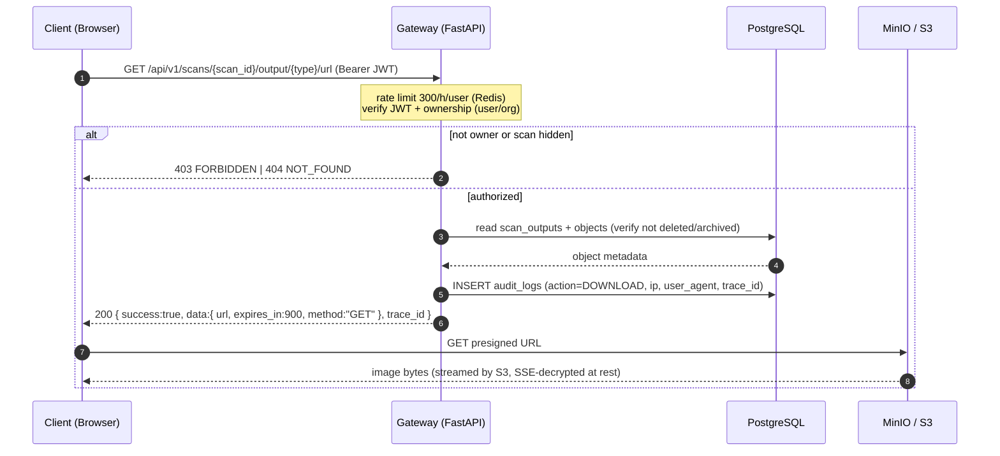

# Sequence — Download (Presigned URL)

Lifecycle: `Client → Gateway (verify + audit) → MinIO (direct download)`.
The browser downloads straight from object storage — FastAPI never proxies image bytes.

## Rules

- Presigned URLs are short-lived (15 min default) and single-object scoped.
- Every download is audited (user, time, IP, device) — medical compliance requirement.
- No image data ever traverses the gateway: backend bandwidth is ~zero, CDN-friendly, cheaper at scale.
- Soft-deleted (`deleted_at` set) or archived (`lifecycle_state = ARCHIVED`) objects return `410`/`404`.
