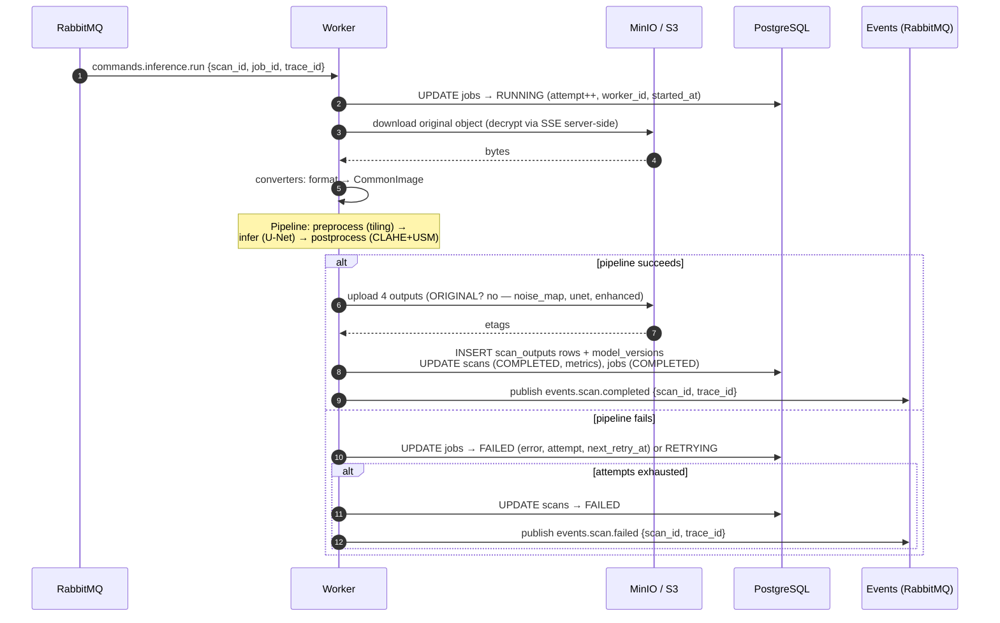

# Sequence — Inference (Worker)

Lifecycle: `RabbitMQ → Worker → MinIO → PostgreSQL → RabbitMQ (event)`.
PostgreSQL is the source of truth; the worker does **not** write Redis.



## Retry state machine

```
QUEUED ─▶ RUNNING ─▶ COMPLETED
              │
              ▼
           FAILED ─▶ RETRYING ─▶ RUNNING ─▶ ...  (attempt < max_attempts=3)
              │
              └── attempts exhausted ─▶ FAILED (terminal, error persisted)
```

- `RETRYING` jobs are picked up by `scheduler/retry_jobs.py` after
  `next_retry_at` backoff.
- A `CANCELLED` state exists for scans soft-deleted mid-flight.
- `job.trace_id` matches the originating request so a single upload is traceable
  across API → queue → worker → S3 → DB.
