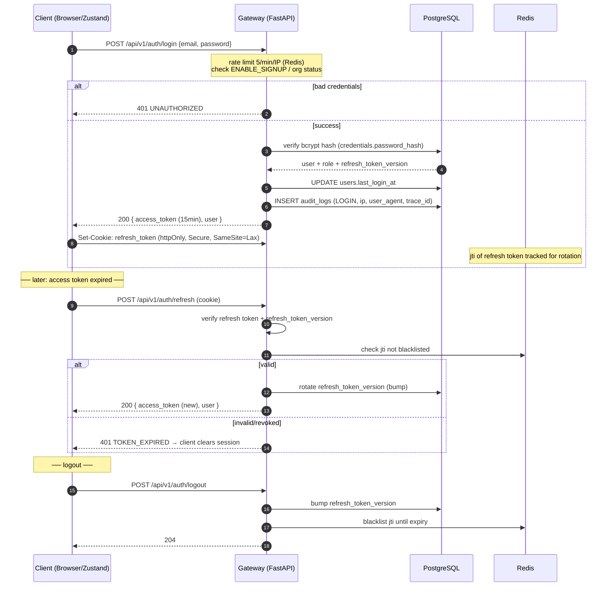

# Sequence — Login & Token Refresh

Lifecycle: access token lives in memory (Zustand); refresh token lives in an
httpOnly Secure SameSite=Lax cookie. Silent refresh on 401.

## Security posture

- **XSS** cannot steal the refresh token (httpOnly cookie).
- **CSRF** mitigated by SameSite=Lax + custom-header checks on state-changing requests.
- Logout revokes the entire token family by bumping `refresh_token_version`.
- Register is rate-limited 3/day/IP; signup can be disabled via `ENABLE_SIGNUP`.
