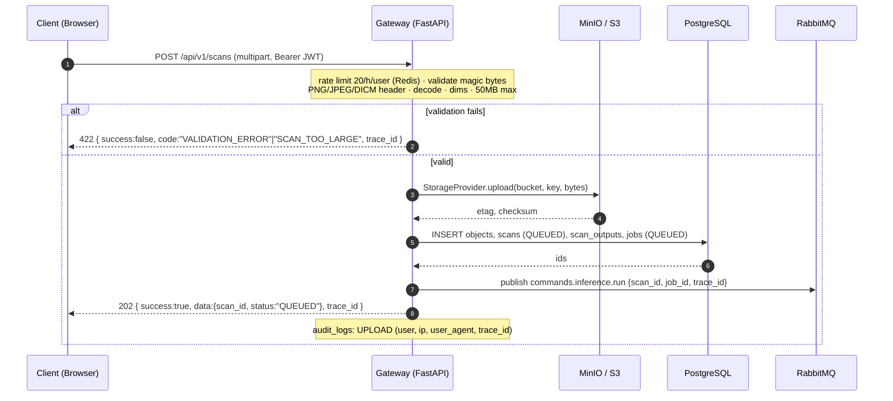

# Sequence — Scan Upload

Lifecycle: `Client → Gateway → MinIO → PostgreSQL → RabbitMQ`, returns `202` immediately.
Async inference happens later via the worker (see `sequence-inference.md`).

## Notes

- Upload is the only synchronous write path; everything after the RabbitMQ
  publish is async.
- The client never receives base64 images anymore — it polls
  `GET /api/v1/scans/{scan_id}` for status.
- The `original` output row (`scan_outputs.type = ORIGINAL`) points at the
  uploaded object.
