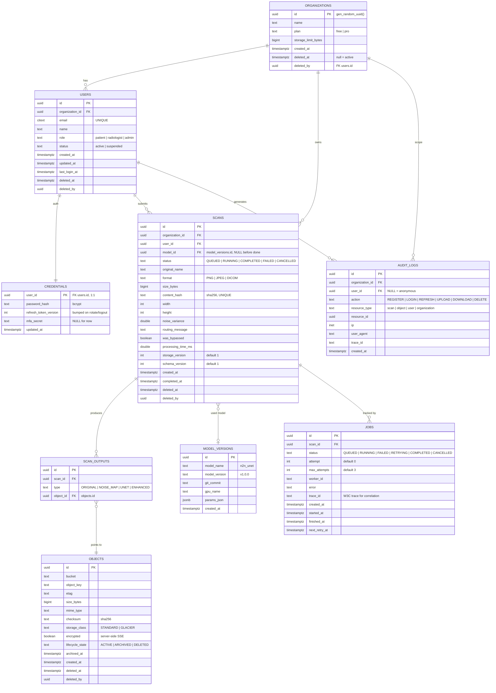

# PostgreSQL ER Diagram

> Status: Accepted — Phase 0 design artifact
> Conventions: every table has `id UUID PRIMARY KEY DEFAULT gen_random_uuid()`.
> Every row that can be removed is soft-deleted via `deleted_at` / `deleted_by`
> (a `UUID` referencing `users.id`). Image bytes never live here — only metadata
> and object keys.

## Relationship diagram

## Indexes (migration creates these)

| Table | Index | Purpose |
|---|---|---|
| users | `uq_users_email` (email) | login lookup — UNIQUE |
| users | `ix_users_organization_id` | org membership |
| scans | `ix_scans_user_id_created_at` (user_id, created_at DESC) | paginated history |
| scans | `uq_scans_content_hash` (content_hash) | dedup — UNIQUE |
| scans | `ix_scans_status` | scheduler + admin |
| scans | `ix_scans_deleted_at` | soft-delete purge (30d) |
| scan_outputs | `uq_scan_outputs_scan_type` (scan_id, type) | one output per type |
| objects | `ix_objects_object_key` | object lookup |
| objects | `ix_objects_lifecycle_state` | archive/delete sweep |
| jobs | `ix_jobs_status_created_at` | retry scheduler |
| jobs | `ix_jobs_scan_id` | scan → job |
| audit_logs | `ix_audit_logs_user_id_created_at` | audit trail queries |
| model_versions | `ix_model_versions_name_version` | model pinning |

## Notes

- **`scan_outputs` is normalized** — adding super-resolution, segmentation, or a
  report PDF later means inserting new `type` rows, never a schema migration.
- **`objects` is storage-agnostic** — bucket/key/etag/checksum only; moving
  MinIO → S3 → R2 touches no other table.
- **`credentials` split from `users`** — OAuth/SSO/LDAP later adds providers
  without touching `users.password_hash` (it doesn't exist there).
- **`organizations` present from day one** — a solo user is an org of one;
  multi-tenant hospital onboarding needs no migration.
- **`jobs.trace_id` + `audit_logs.trace_id`** enable end-to-end correlation
  (API → RabbitMQ → worker → S3 → DB).
- All UUIDs are generated with `gen_random_uuid()` (PG 13+); `citext` and `inet`
  types require `citext` (default in many images) / native `inet`.
