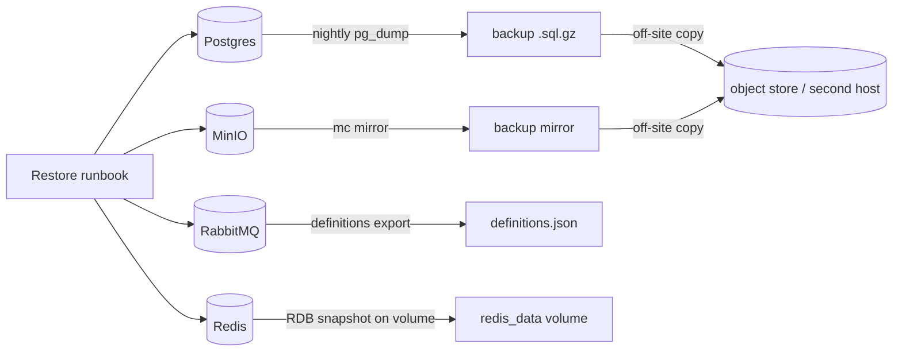

# Backup & Restore

> Sprint 4D (ADR-015). Self-hosted state services on the canonical single-VM
> deployment. Targets: **RPO ≤ 24 h** (nightly logical backups), **RTO ≤ 4 h**
> (restore from backup on the VM). Managed alternatives (RDS/S3/etc.) inherit
> their provider's backup story — see ADR-015.



## What to back up

| Service | Method | Granularity | What's lost without it |
| --- | --- | --- | --- |
| PostgreSQL | `pg_dump` (logical), nightly; WAL archiving = follow-on for PITR | schema + data | **everything** — users, jobs, scans |
| MinIO / S3 | `mc mirror` nightly (or bucket replication on managed S3) | objects | uploaded scans + outputs |
| RabbitMQ | `rabbitmqadmin export` (definitions) | topology | durable queue + exchange definitions |
| Redis | RDB snapshot on its volume (already on by default) | cache/counters | rate-limit state, cleanup locks (recomputable) |

## Nightly backup (single VM)

Postgres dump via a one-shot container on the compose network:

```sh
cd deploy/production
mkdir -p /var/backups/denoise
docker compose exec -T postgres \
  pg_dump -U "$POSTGRES_USER" -d "$POSTGRES_DB" -Fc \
  | gzip > "/var/backups/denoise/$(date +%F).sql.gz"
```

MinIO mirror (uses the `mc` CLI from the `minio-init` service — same compose
network, no hardcoded network name). `-e VAR` passes the `.env` value through.
Set `BACKUP_ACCESS_KEY` / `BACKUP_SECRET_KEY` in `.env` (or export them) to the
**off-site** endpoint of your choice — a backup on the same VM is not a backup:

```sh
cd deploy/production
set -a && . ./.env && set +a   # load the .env values into the shell
docker compose run --rm --no-deps \
  -e "MINIO_ROOT_USER=$MINIO_ROOT_USER" -e "MINIO_ROOT_PASSWORD=$MINIO_ROOT_PASSWORD" \
  -e "S3_BUCKET=$S3_BUCKET" \
  -e "BACKUP_ACCESS_KEY=$BACKUP_ACCESS_KEY" -e "BACKUP_SECRET_KEY=$BACKUP_SECRET_KEY" \
  minio-init sh -c '
    mc alias set local http://minio:9000 "$MINIO_ROOT_USER" "$MINIO_ROOT_PASSWORD"
    mc alias set backup https://s3.example.com "$BACKUP_ACCESS_KEY" "$BACKUP_SECRET_KEY"
    mc mirror --overwrite local/$S3_BUCKET backup/$S3_BUCKET
  '
```

RabbitMQ definitions — the default user is `denoise` (from `.env`), not
`guest`/`guest`, so pass credentials explicitly:

```sh
cd deploy/production
set -a && . ./.env && set +a
docker compose exec rabbitmq \
  rabbitmqadmin -u "$RABBITMQ_USER" -p "$RABBITMQ_PASS" export /tmp/definitions.json
docker cp production-rabbitmq-1:/tmp/definitions.json /var/backups/denoise/definitions.json
```

Schedule all three as a systemd timer / cron (`@daily`), then **copy the
`.sql.gz` and the mirror off-site** (object storage on a second host, or a
different region). A backup that lives on the same VM is not a backup.

## Object lifecycle (ADR-015 / ADR-003)

The app already exposes `OBJECT_ARCHIVE_DAYS=30` and `OBJECT_DELETE_DAYS=365`
knobs. Wire them to the object store lifecycle so old scans are archived then
deleted (scheduler cleanup purges DB rows; lifecycle rules cover the objects):

- **MinIO:** an idle/ILM rule on `denoise-xray` — transition to a colder tier
  after `OBJECT_ARCHIVE_DAYS`, expire after `OBJECT_DELETE_DAYS`.
- **Managed S3:** a bucket lifecycle rule with the same two transitions.

## Restore runbook (target ≤ 4 h)

> **Proven in Sprint 4E:** this runbook (Postgres restore, MinIO mirror-back,
> RabbitMQ import, down/up persistence) was executed against the live local
> deployment in 2026-08-08 — counts restored exactly, MinIO objects byte-for-byte.

1. **Provision/repair the VM** and bring up `postgres`, `redis`, `rabbitmq`,
   `minio` from `deploy/production/docker-compose.yml` (infra-only is fine).
2. **Postgres:** drop and recreate the schema, then load the nightly dump
   (pipe the host-side backup file into the container — same direction as the
   backup command; the container has no `/var/backups` mount):
   ```sh
   cd deploy/production
   set -a && . ./.env && set +a
   gunzip -c /var/backups/denoise/YYYY-MM-DD.sql.gz \
     | docker compose exec -T postgres \
         pg_restore -U "$POSTGRES_USER" -d "$POSTGRES_DB" --clean --if-exists
   ```
3. **RabbitMQ:** import the definitions export with explicit credentials
   (guest/guest is not the default user here):
   ```sh
   docker cp /var/backups/denoise/definitions.json production-rabbitmq-1:/tmp/definitions.json
   docker compose exec rabbitmq \
     rabbitmqadmin -u "$RABBITMQ_USER" -p "$RABBITMQ_PASS" import /tmp/definitions.json
   ```
   Queued work is re-published by clients/retry on the next cycle.
4. **MinIO/S3:** `mc mirror` back from the backup location (or rely on bucket
   replication for the managed path). The app's `STORAGE_PROVIDER` seam
   (ADR-015) means the object layer can be restored to S3 even if it was MinIO:
   ```sh
   docker compose run --rm --no-deps \
     -e "MINIO_ROOT_USER=$MINIO_ROOT_USER" -e "MINIO_ROOT_PASSWORD=$MINIO_ROOT_PASSWORD" \
     -e "S3_BUCKET=$S3_BUCKET" \
     -e "BACKUP_ACCESS_KEY=$BACKUP_ACCESS_KEY" -e "BACKUP_SECRET_KEY=$BACKUP_SECRET_KEY" \
     -v /var/backups/denoise/minio:/backup \
     minio-init sh -c '
       mc alias set local http://minio:9000 "$MINIO_ROOT_USER" "$MINIO_ROOT_PASSWORD"
       mc alias set backup https://s3.example.com "$BACKUP_ACCESS_KEY" "$BACKUP_SECRET_KEY"
       mc mirror --overwrite backup/$S3_BUCKET local/$S3_BUCKET
     '
   ```
5. **Redis:** empty is acceptable (counters reset, locks expire); restore the
   RDB only if desired.
6. **Bring the app up** and verify:
   ```sh
   docker compose up -d
   curl -sf https://api.<SITE_DOMAIN>/health/ready
   ```
7. **Verify the restore** — a backup that has never been restored is a guess:
   - Row counts match the backup (`users`, `scans`, `jobs`, `objects`).
   - A presigned download works through the public edge
     (`s3.<SITE_DOMAIN>` → MinIO, ADR-003/ADR-018): `GET
     /api/v1/scans/{id}/outputs/ENHANCED/url` returns a `download_url` whose
     host is `https://s3.<SITE_DOMAIN>`, and `curl -k "$download_url"` returns
     HTTP 200 with the expected PNG (local mode is self-signed — use `-k`).
8. **Test the restore** quarterly.

## Notes & limits

- `pg_dump -Fc` gives a logical backup; **WAL archiving for point-in-time
  recovery is a documented follow-on**, not yet configured (RPO ≤ 24 h is met
  by the nightly dump).
- Redis and RabbitMQ loss windows are best-effort by design (ADR-015); the
  durable sources of truth are Postgres and the object store.
