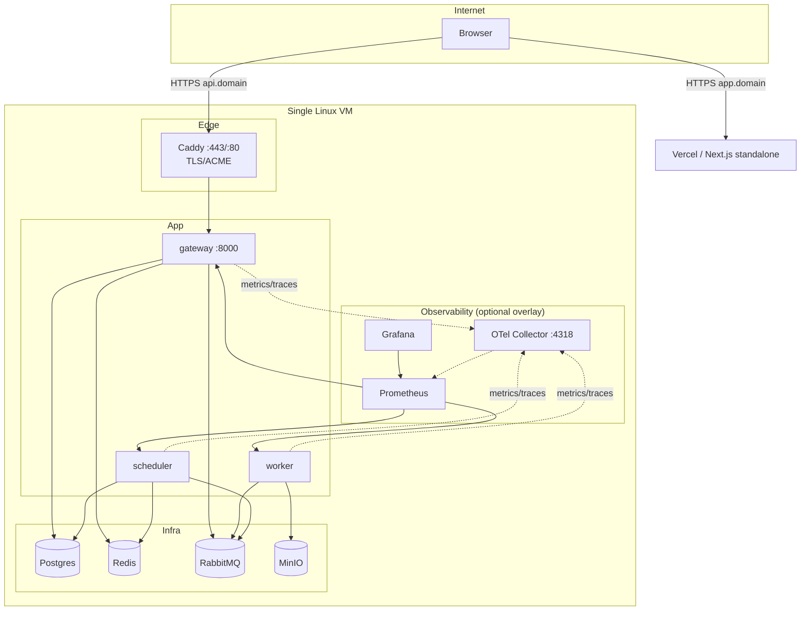

# Denoise X — Production Deployment

> Sprint 4D (ADR-012). Canonical topology: **Docker Compose on a single Linux
> VM**. Kubernetes is a documented alternative (`deploy/k8s/`, `deploy/terraform/`
> — reference material, **not** production-ready). Managed services are a
> documented alternative (ADR-015).

## Topology



- Only Caddy is exposed to the internet (`:80`/`:443`). Every other service is
  internal-only on the compose network.
- The API edge is `https://api.<SITE_DOMAIN>` → `gateway:8000`.
- The frontend is deployed separately (Vercel recommended) at its own DNS
  record, e.g. `https://app.<SITE_DOMAIN>`; `CORS_ORIGINS` points at it.

## Two supported deployment modes

The production compose file (`deploy/production/docker-compose.yml`) carries
both `image:` (GHCR, ADR-016) and `build:` (source) per service. Switching is
just choosing which command to run:

| Mode | Command | Requirement |
| --- | --- | --- |
| Dev / first deployment | `docker compose build && docker compose up -d` | source checkout on the VM, no registry |
| CI-produced artifacts | `docker compose pull && docker compose up -d` | `docker login ghcr.io` (ADR-014) |

Pinning: set `IMAGE_TAG` in `.env` to a concrete `<sha>` / `<semver>` /
`<sprint-tag>` for upgrades — never upgrade with `latest` (ADR-017).

## Provisioning (first time)

```sh
# 1. Create a Linux VM (any cloud). Open inbound :80 and :443 only.
# 2. Install Docker Engine + Compose plugin (docs.docker.com).
# 3. DNS: point api.<SITE_DOMAIN> A record at the VM's public IP.
#    (Let's Encrypt HTTP-01 needs this before first Caddy boot.)
```

```sh
# 4. Clone the repo (deploy dir) or copy deploy/production/ only.
git clone git@github.com:Reckz69/medical-xray.git
cd medical-xray/deploy/production

# 5. Create secrets and configure the environment (ADR-014).
./generate-secrets.sh                     # unique credentials, printed once
$EDITOR .env                              # SITE_DOMAIN, ACME_EMAIL, CORS_ORIGINS

# 6. Place and verify the model weights (ADR-011). The weights are gitignored.
mkdir -p /opt/denoise
gh release download weights-v1 \
  --repo Reckz69/medical-xray \
  --pattern 'n2n_unet_best_weights04.keras' \
  --dir /opt/denoise
bash ../../scripts/verify_weights.sh       # filename + size + SHA-256
# 7. Set MODEL_WEIGHTS_PATH=/opt/denoise/n2n_unet_best_weights04.keras in .env

# 8. Bring it up (dev/first-deployment mode).
docker compose up -d --build

# 9. Verify.
docker compose ps                            # all healthy
curl -sf https://api.<SITE_DOMAIN>/health/ready
```

The observability overlay is optional:

```sh
docker compose -f docker-compose.yml -f observability.yml up -d
```

## Ports matrix

| Service | Container port | Host exposure |
| --- | --- | --- |
| Caddy | 80/443 | `:80`, `:443` (public, the only ingress) |
| gateway | 8000 | internal (Caddy only) |
| worker | — | internal |
| scheduler | — | internal |
| postgres | 5432 | none |
| redis | 6379 | none |
| rabbitmq | 5672 / 15672 | none |
| minio | 9000 / 9001 | none |
| otel-collector / prometheus / grafana | 4318 / 9090 / 3000 | none (reach via SSH tunnel) |

## Upgrade / rollback

Upgrades pin the compatibility matrix (ADR-017): schema revision + images +
weights must be a known-good pairing.

```sh
cd deploy/production
docker compose pull                          # new images (IMAGE_TAG pinned)
docker compose up -d                         # roll-forward: app containers restart

# Database schema: the gateway runs `alembic upgrade head` on start (idempotent).
# For schema-change releases, run the migration explicitly first:
docker compose run --rm gateway alembic upgrade head
```

Rollback:

```sh
# Set IMAGE_TAG back to the previous known-good tag, then:
docker compose pull && docker compose up -d
```

**Ordering rule (ADR-017):** run schema migrations forward *before* starting
the new app version; roll back the app *before* rolling back the schema.

## Backups / restore / rotation

See `docs/engineering/backup-restore.md` (RPO ≤ 24 h, RTO ≤ 4 h) and
`docs/engineering/secret-rotation.md`.

## Production readiness

Before production traffic: work through
`docs/engineering/production-checklist.md` (TLS verified, no default creds,
non-root hardening, resource limits, tested backups, monitoring/alerting).
