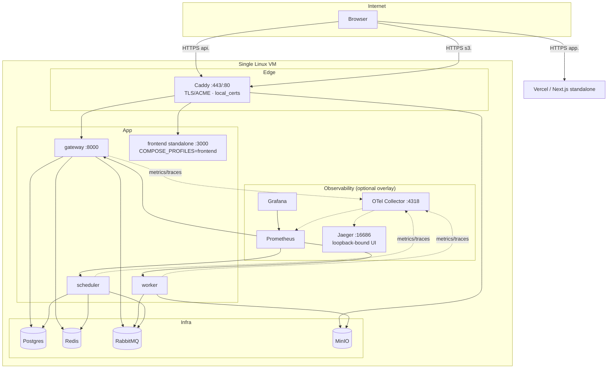

# Denoise X — Production Deployment

> Sprint 4D/4E (ADR-012/ADR-018). Canonical topology: **Docker Compose on a
> single Linux VM**. Kubernetes is a documented alternative (`deploy/k8s/`,
> `deploy/terraform/` — reference material, **not** production-ready). Managed
> services are a documented alternative (ADR-015). The stack is runtime
> configurable: one compose file, `.env` selects local vs cloud (ADR-018).

## Topology



- Only Caddy is exposed to the internet (`:80`/`:443`). Every other service is
  internal-only on the compose network.
- The API edge is `https://api.<SITE_DOMAIN>` → `gateway:8000`.
- Presigned download URLs (ADR-003) are served through the Caddy edge at
  `https://s3.<SITE_DOMAIN>` → `minio:9000` (no gzip — S3 objects verbatim).
  The gateway builds those URLs against `S3_PUBLIC_ENDPOINT` (ADR-018).
- The frontend is either the containerized Next.js standalone image on the
  compose network (`COMPOSE_PROFILES=frontend`, Caddy proxies `<SITE_DOMAIN>` →
  `FRONTEND_UPSTREAM`), or deployed separately (Vercel recommended) at its own
  DNS record; `CORS_ORIGINS` points at the real frontend origin.

## HTTPS / ingress flow (ADR-013)

```mermaid
sequenceDiagram
    participant B as Browser
    participant D as DNS
    participant C as Caddy (:443)
    participant G as gateway:8000
    participant F as frontend (Vercel)

    B->>D: api.<domain>
    B->>C: HTTPS request
    C-->>C: terminate TLS (Let's Encrypt, auto-renew)
    C->>G: plain HTTP (internal network)
    G-->>C: response
    C-->>B: HTTPS response

    alt frontend served by Vercel
        B->>D: app.<domain>
        B->>F: HTTPS (Vercel edge)
    else frontend containerized on VM
        B->>D: <domain>
        B->>C: HTTPS request
        C->>F: reverse_proxy ($FRONTEND_UPSTREAM)
    end
```



Caddy issues and renews certificates automatically (ACME); nothing else on the
VM is reachable from the internet (ADR-013).

## Two supported deployment modes

The production compose file (`deploy/production/docker-compose.yml`) carries
both `image:` (GHCR, ADR-016) and `build:` (source) per service. Switching is
just choosing which command to run:

| Mode | Command | Requirement |
| --- | --- | --- |
| Dev / first deployment | `docker compose build && docker compose up -d` | source checkout on the VM, no registry |
| CI-produced artifacts | `docker compose pull && docker compose up -d` | `docker login ghcr.io` (ADR-014) |

Pinning: set `IMAGE_TAG` in `.env` to a concrete `<sha>` / `<semver>` /
`<sprint-tag>` for upgrades — never upgrade with `latest` (ADR-017).

## Runtime configuration (ADR-018)

One compose stack runs everywhere; **`.env` is the only thing that changes
between environments** (no `LOCAL`/`CLOUD` branches in code). The two supported
configurations are fully spelled out at the top of
`deploy/production/.env.example`:

| Knob | Local (default) | Cloud |
| --- | --- | --- |
| `SITE_DOMAIN` | `localhost` | `denoise-x.example.com` |
| `CADDYFILE` | `Caddyfile.local` (Caddy internal CA) | `Caddyfile` (Let's Encrypt) |
| `COMPOSE_PROFILES` | `frontend` (containerized frontend) | empty (Vercel) |
| `CORS_ORIGINS` | `["https://localhost"]` | `["https://app.<SITE_DOMAIN>"]` |
| `S3_PUBLIC_ENDPOINT` | `https://s3.localhost` | `https://s3.<SITE_DOMAIN>` |
| `ACME_EMAIL` | empty | `ops@example.com` |
| `MODEL_WEIGHTS_PATH` | `../../n2n_unet_best_weights04.keras` | `/opt/denoise/n2n_unet_best_weights04.keras` |

`S3_PUBLIC_ENDPOINT` (Sprint 4E, ADR-003): the gateway reads/writes objects via
internal `S3_ENDPOINT` but issues presigned **download** URLs against the
browser-reachable `s3.<SITE_DOMAIN>` edge, so downloads never proxy through the
API. Cloud mode needs an `s3.` A record → the VM (Caddy issues the cert
automatically); MinIO's SDK rejects path-style endpoints, hence the subdomain.
Empty → presign with `S3_ENDPOINT` (internal/tooling only, not browser-reachable).

Local mode certs are self-signed (Caddy internal CA) — trust the CA once, or
use `curl -k` for smoke checks.

## Provisioning (first time)

```sh
# 1. Create a Linux VM (any cloud). Open inbound :80 and :443 only.
# 2. Install Docker Engine + Compose plugin (docs.docker.com).
# 3. DNS: point api.<SITE_DOMAIN> and s3.<SITE_DOMAIN> A records at the VM's
#    public IP. (Let's Encrypt HTTP-01 needs these before first Caddy boot.)
```

```sh
# 4. Clone the repo (deploy dir) or copy deploy/production/ only.
git clone git@github.com:Reckz69/medical-xray.git
cd medical-xray/deploy/production

# 5. Create secrets and configure the environment (ADR-014/ADR-018).
./generate-secrets.sh                     # unique credentials, printed once
$EDITOR .env                              # pick LOCAL or CLOUD block (ADR-018)

# 6. Place and verify the model weights (ADR-011). The weights are gitignored.
#    LOCAL: leave MODEL_WEIGHTS_PATH=../../n2n_unet_best_weights04.keras and
#    download into the repo root. CLOUD: put them under /opt/denoise.
mkdir -p /opt/denoise
gh release download weights-v1 \
  --repo Reckz69/medical-xray \
  --pattern 'n2n_unet_best_weights04.keras' \
  --dir /opt/denoise
bash ../../scripts/verify_weights.sh       # filename + size + SHA-256
# 7. Set MODEL_WEIGHTS_PATH=/opt/denoise/n2n_unet_best_weights04.keras in .env
#    (cloud only; the local default already points at the repo root).

# 8. Bring it up (dev/first-deployment mode). Local mode: COMPOSE_PROFILES=frontend
#    includes the containerized frontend; Caddyfile.local serves api/s3/localhost.
docker compose up -d --build

# 9. Verify.
docker compose ps                            # all healthy
curl -sf https://api.<SITE_DOMAIN>/health/ready
```

The observability overlay (Jaeger + OTel + Prometheus + Grafana, ADR-010) is
optional but recommended; run the same overlay in both modes so local equals
prod:

```sh
docker compose -f docker-compose.yml -f observability.yml up -d
```

## Ports matrix

| Service | Container port | Host exposure |
| --- | --- | --- |
| Caddy | 80/443 | `:80`, `:443` (public, the only ingress) |
| gateway | 8000 | internal (Caddy only) |
| worker | — | internal |
| scheduler | — | internal |
| postgres | 5432 | none |
| redis | 6379 | none |
| rabbitmq | 5672 / 15672 | none |
| minio | 9000 / 9001 | none |
| otel-collector / prometheus / grafana / jaeger | 4318 / 9090 / 3000 / 16686 | none (reach via SSH tunnel; Jaeger UI is loopback-bound) |

## Health endpoints & worker heartbeat (Sprint 4F)

Three health endpoints, split by audience:

| Endpoint | Auth | Purpose |
| --- | --- | --- |
| `/health/live` | public | Liveness — process is up (load-balancer / K8s probe). |
| `/health/ready` | public | Readiness — Postgres + Redis reachable (routed for user traffic). |
| `/health/infra` | bearer (`health_infra_auth`, ON in production) | Full matrix for the operator dashboard — dependency checks, worker liveness, model + queue state. |

`/health/infra` returns `200 ok` when every dependency is green and the worker
last reported alive within its TTL; `503 degraded` otherwise (still with a full
body so the status page renders partial state). App version + `git_sha` are
captured once at import time (`gateway/core/buildinfo.py`), so a mis-deployed
image is visible on the status page instead of silently reporting stale code.

### Worker heartbeat registry

The worker does not run in-process with the gateway, so the gateway tracks it
via a Redis heartbeat (`gateway/core/worker_registry.py`, schema v1):

- Every `HEARTBEAT_INTERVAL` seconds the worker writes `worker:active:<id>` with
  a TTL of `HEARTBEAT_TTL` seconds and adds its id to the `worker:active` set.
- The registry reports the freshest heartbeat per worker; stale entries (past
  TTL) are pruned. A worker is **alive** iff a heartbeat is fresh at query time.
- Heartbeat/registry reads are telemetry-only and **never raise** — an
  unreachable Redis does not take down `/health/infra`, it just degrades the
  worker/queue row to `null`.
- The registry also carries the loaded model name/version and GPU state so the
  dashboard can show which model is actually serving.

The queue row reads `inference.worker` depth best-effort: depth is a hint for
the dashboard and degrades to `null` (never a 5xx) if RabbitMQ is busy or down.

### Verifying after deploy

```sh
curl -sf https://api.<SITE_DOMAIN>/health/live
curl -sf https://api.<SITE_DOMAIN>/health/ready
curl -sf https://api.<SITE_DOMAIN>/health/infra \
  -H "Authorization: Bearer <ops-token>"      # 200 ok when worker is alive
```

## Upgrade / rollback

Upgrades pin the compatibility matrix (ADR-017): schema revision + images +
weights must be a known-good pairing.

```sh
cd deploy/production
docker compose pull                          # new images (IMAGE_TAG pinned)
docker compose up -d                         # roll-forward: app containers restart

# Database schema: the gateway runs `alembic upgrade head` on start (idempotent).
# For schema-change releases, run the migration explicitly first:
docker compose run --rm gateway alembic upgrade head
```

Rollback:

```sh
# Set IMAGE_TAG back to the previous known-good tag, then:
docker compose pull && docker compose up -d
```

**Ordering rule (ADR-017):** run schema migrations forward *before* starting
the new app version; roll back the app *before* rolling back the schema.

## Backups / restore / rotation

See `docs/engineering/backup-restore.md` (RPO ≤ 24 h, RTO ≤ 4 h) and
`docs/engineering/secret-rotation.md`.

## Production readiness

Before production traffic: work through
`docs/engineering/production-checklist.md` (TLS verified, no default creds,
non-root hardening, resource limits, tested backups, monitoring/alerting).
