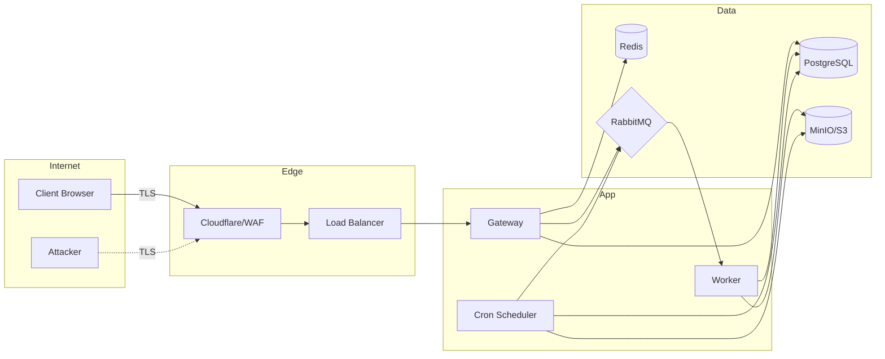

# Threat Model — STRIDE

> Status: Accepted — Phase 0 design artifact
> Scope: the Denoise X platform as specced in `system-architecture.md`.
> Reviewed for the initial deployment (Docker Compose locally, single-node) and
> the target K8s/AWS deployment.

## Assets

| # | Asset | Confidentiality | Integrity | Availability |
|---|---|---|---|---|
| A1 | X-ray image bytes (object storage) | Critical — patient PHI | High | High |
| A2 | Scan metadata (PostgreSQL) | Critical — PHI-linked | High | High |
| A3 | Credentials (password hashes, refresh tokens) | Critical | High | Medium |
| A4 | Audit logs | High | Critical (non-repudiation) | Medium |
| A5 | Model weights / inference pipeline | Medium | High | Medium |
| A6 | API + worker availability | Medium | Medium | Critical |

## Trust boundaries

Boundaries: **B1** Internet↔Edge, **B2** Edge↔Gateway, **B3** Gateway↔Data
(internal network), **B4** Gateway↔Worker↔Data, **B5** App↔Observability.

## STRIDE analysis

### 1. Spoofing

| Threat | Asset | Risk | Mitigation |
|---|---|---|---|
| Forged JWT / stolen access token | A2, A3 | High | Short-lived access tokens (15 min); refresh rotation via `refresh_token_version`; `jti` blacklist in Redis |
| Identity theft via stolen refresh cookie | A3 | High | httpOnly + Secure + SameSite=Lax cookie; rotation on every refresh; revocation on logout |
| Attacker registers as staff user | A2 | Medium | `ENABLE_SIGNUP` flag; role defaults to `patient`; admin promotion only server-side |
| Email enumeration on login | A3 | Medium | Uniform 401 on "no user" and "bad password"; rate limit 5/min/IP |
| DICOM/PNG claiming wrong format | A1 | Medium | Magic-byte validation + decode check; never trust content-type |

### 2. Tampering

| Threat | Asset | Risk | Mitigation |
|---|---|---|---|
| Image tampered in transit/at rest | A1 | High | TLS everywhere; SSE-KMS at rest (MinIO SSE locally); object checksum (sha256) verified on download |
| Scan metadata altered | A2 | High | DB accessed only via repository layer; row-level ownership checks; audit of state transitions |
| Presigned URL replayed/shared | A1 | Medium | 15-min expiry; single-object scope; download audited (user/IP/UA) |
| Malicious image → RCE in parser | A1, A5 | High | Process isolation (worker container, non-root); pinned parser versions; input size caps; decode before any ML work |

### 3. Repudiation

| Threat | Asset | Risk | Mitigation |
|---|---|---|---|
| User denies uploading/downloading PHI | A4 | High | `audit_logs` written synchronously for UPLOAD/DOWNLOAD/DELETE with ip + user_agent + trace_id; append-only intent |
| Operator denies config change | A4 | Medium | Audit actions recorded; deployment via GitOps (CI/CD) so changes are reviewable |

### 4. Information disclosure

| Threat | Asset | Risk | Mitigation |
|---|---|---|---|
| Unauthorized scan access (IDOR) | A1, A2 | Critical | Every scan endpoint enforces org+owner scope; UUIDs (non-enumerable) but **never** the only control |
| Image exfil via gateway proxy | A1 | High | Presigned URLs only — image bytes never traverse the gateway |
| Secrets in logs/env | A3 | High | No secrets logged; `.env` never committed; gitleaks in CI; secrets via env/secret manager |
| Timing side-channel on login | A3 | Low | Constant-time bcrypt; uniform responses |
| PHI leakage to observability | A1 | Medium | Redact request bodies; no image payloads in traces; PII fields excluded from metrics |

### 5. Denial of service

| Threat | Asset | Risk | Mitigation |
|---|---|---|---|
| Upload flood exhausting queue/DB | A6 | High | Upload rate limit 20/h/user (Redis); per-org storage limits; 50MB cap |
| Login/register brute force | A6 | Medium | Endpoint-specific rate limits (5/min, 3/day per IP) |
| Download bandwidth abuse | A6 | High | 300/h/user rate limit; presigned URL TTL; CDN in front |
| Worker saturation (GPU) | A6 | High | RabbitMQ prefetch=1; job max_attempts; dead-letter; HPA on queue depth in K8s |
| Redis/DB connection exhaustion | A6 | Medium | Connection pooling limits; `health/ready` gating |
| RabbitMQ message burst | A6 | Medium | Queue TTLs, prefetch, consumer ack discipline |

### 6. Elevation of privilege

| Threat | Asset | Risk | Mitigation |
|---|---|---|---|
| Patient escalates to radiologist/admin | A2 | High | Role enforced server-side on every request (`deps.get_current_user`); no client-supplied role |
| Worker tampers with results | A1 | Medium | Worker is internal-only (no public network); writes validated by repository layer; model_versions + git_commit recorded |
| Scheduler triggers unauthorized cleanup | A2 | Medium | Scheduler uses least-privilege DB/queue credentials; idempotent jobs |
| SSRF via object-storage URLs | A6 | Medium | Storage endpoints hardcoded/from config; no user-controlled URLs fetched by backend |

## Ranked top risks (mitigation priority)

1. **IDOR / cross-tenant scan access** — strict org+owner checks + integration tests.
2. **RCE via malicious image parsing** — worker container isolation + pinned deps + fuzz inputs.
3. **PHI disclosure at rest / in transit** — TLS + SSE-KMS, no proxy streaming.
4. **Repudiation** — synchronous audit writes with IP/UA/trace_id.
5. **DoS on upload/download** — Redis rate limits + prefetch + caps.

## Security requirements that flow to later phases

- **SR-1** (Phase 2): constant-time bcrypt, JWT + refresh rotation, httpOnly cookies, register flag.
- **SR-2** (Phase 3): magic-byte validation, size/dimension caps, checksum on upload.
- **SR-3** (Phase 4): worker as non-root, read-only filesystem where possible, pinned deps.
- **SR-4** (Phase 5): synchronous DOWNLOAD audit, ownership checks, soft-delete.
- **SR-5** (Phase 8): bandit, pip-audit, gitleaks, trivy in CI; dependency pinning; non-root containers.
